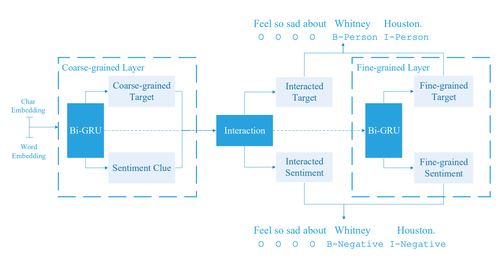

# Interactive Multi-Grained Joint Model for Targeted Sentiment Analysis

This repo is the TensorFlow implementation of **Interactive Multi-Grained Joint Model for Targeted Sentiment Analysis** which was accepted by ACM CIKM 2019.



## Usage

WIP

## Citation

You can cite this [paper](https://dl.acm.org/citation.cfm?id=3357384.3358024) if you use this model

```
@inproceedings{Yin:2019:IMJ:3357384.3358024,
 author = {Yin, Da and Liu, Xiao and Wan, Xiaojun},
 title = {Interactive Multi-Grained Joint Model for Targeted Sentiment Analysis},
 booktitle = {Proceedings of the 28th ACM International Conference on Information and Knowledge Management},
 series = {CIKM '19},
 year = {2019},
 isbn = {978-1-4503-6976-3},
 location = {Beijing, China},
 pages = {1031--1040},
 numpages = {10},
 url = {http://doi.acm.org/10.1145/3357384.3358024},
 doi = {10.1145/3357384.3358024},
 acmid = {3358024},
 publisher = {ACM},
 address = {New York, NY, USA},
 keywords = {interaction mechanism, joint model, multi-grained model, neural networks, sentiment analysis, sequence labeling},
} 
```

## License

[MIT](LICENSE)
