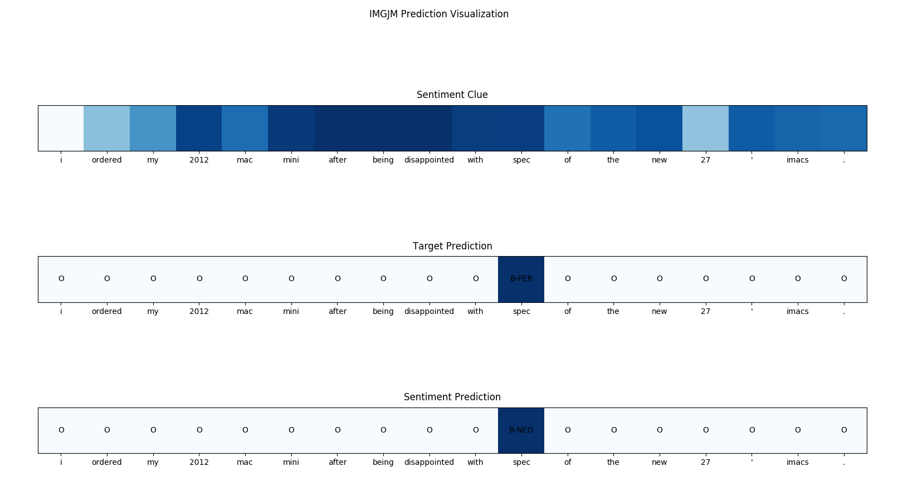

# Interactive Multi-Grained Joint Model for Targeted Sentiment Analysis

This repository is the TensorFlow implementation of **Interactive Multi-Grained Joint Model for Targeted Sentiment Analysis** which was accepted by ACM CIKM 2019.


## Usage

### Environment Setup

Just use pipenv to install requirements.

```bash
pipenv install
```

### Train Model

```bash
pipenv run python train.py --mock_embedding=[True|False] 
                           --epochs=[nums]
```

### Plot Demo Figure

```bash
pipenv run python train.py --mock_embedding=[True|False]
```

## Performance

We temporarily remove dropout layers because we don't know the correct positions they should be placed and they affect the performance dramatically.

- Word embedding: GloVe.840B.300D
- Model settings
  - epochs: 50
  - learning_rate: 0.001
  - **dropout_rate: 0.0**
  - batch_size: 32
  - kernel_size: 3
  - filter_nums: 50
  - C_tar: 3
  - C_sent: 7
  - beta: 1.0
  - gamma: 0.7

### Entity Extraction

#### Train

| Dataset                | Dropout | Embedding | Precision | Recall | F1    |
| ---------------------- | ------- | --------- | --------- | ------ | ----- |
| SemEval2014-Laptop     | 0.0     | GloVe     | 0.768     | 0.531  | 0.628 |
| SemEval2014-Restaurant | 0.0     | GloVe     | 0.776     | 0.564  | 0.653 |
| Twitter                | 0.0     | GloVe     | 0.998     | 0.996  | 0.997 |

#### Test

| Dataset                | Dropout | Embedding | Precision | Recall | F1    |
| ---------------------- | ------- | --------- | --------- | ------ | ----- |
| SemEval2014-Laptop     | 0.0     | GloVe     | 0.679     | 0.433  | 0.529 |
| SemEval2014-Restaurant | 0.0     | GloVe     | 0.632     | 0.318  | 0.423 |
| Twitter                | 0.0     | GloVe     | 0.990     | 0.987  | 0.989 |

### Sentiment Analysis

#### Train

| Dataset                | Dropout | Embedding | Precision | Recall | F1    |
| ---------------------- | ------- | --------- | --------- | ------ | ----- |
| SemEval2014-Laptop     | 0.0     | GloVe     | 0.743     | 0.507  | 0.603 |
| SemEval2014-Restaurant | 0.0     | GloVe     | 0.771     | 0.532  | 0.630 |
| Twitter                | 0.0     | GloVe     | 0.957     | 0.954  | 0.955 |

#### Test

| Dataset                | Dropout | Embedding | Precision | Recall | F1    |
| ---------------------- | ------- | --------- | --------- | ------ | ----- |
| SemEval2014-Laptop     | 0.0     | GloVe     | 0.474     | 0.285  | 0.356 |
| SemEval2014-Restaurant | 0.0     | GloVe     | 0.539     | 0.230  | 0.322 |
| Twitter                | 0.0     | GloVe     | 0.668     | 0.665  | 0.666 |

## Case Study

We also build a sentiment clue visualization tool to find the reason why sentiment prediction was produced. You can use `demo.py` to produce the following figure.



## Citation

You can cite this [paper](https://dl.acm.org/citation.cfm?id=3357384.3358024) if you use this model

```
@inproceedings{Yin:2019:IMJ:3357384.3358024,
 author = {Yin, Da and Liu, Xiao and Wan, Xiaojun},
 title = {Interactive Multi-Grained Joint Model for Targeted Sentiment Analysis},
 booktitle = {Proceedings of the 28th ACM International Conference on Information and Knowledge Management},
 series = {CIKM '19},
 year = {2019},
 isbn = {978-1-4503-6976-3},
 location = {Beijing, China},
 pages = {1031--1040},
 numpages = {10},
 url = {http://doi.acm.org/10.1145/3357384.3358024},
 doi = {10.1145/3357384.3358024},
 acmid = {3358024},
 publisher = {ACM},
 address = {New York, NY, USA},
 keywords = {interaction mechanism, joint model, multi-grained model, neural networks, sentiment analysis, sequence labeling},
} 
```

## License

[MIT](LICENSE)
